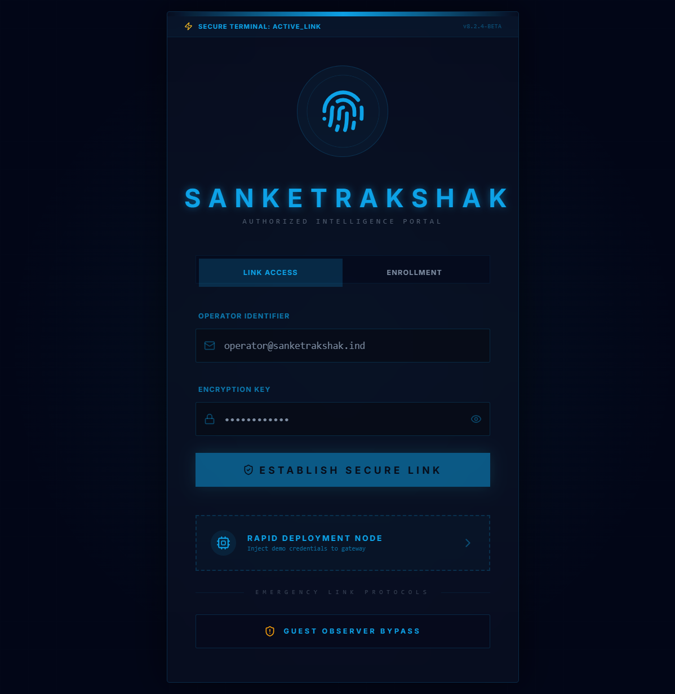
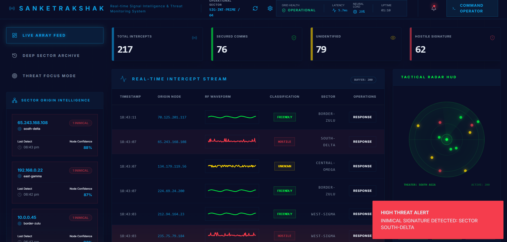
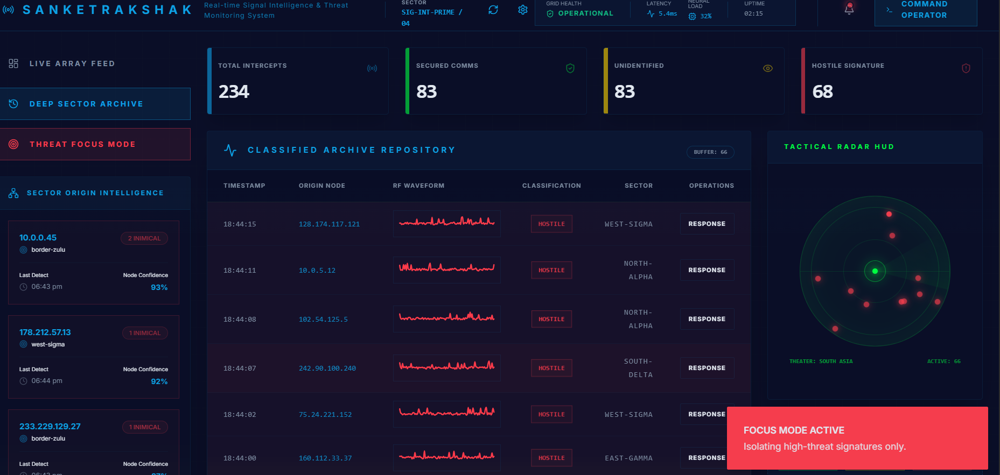
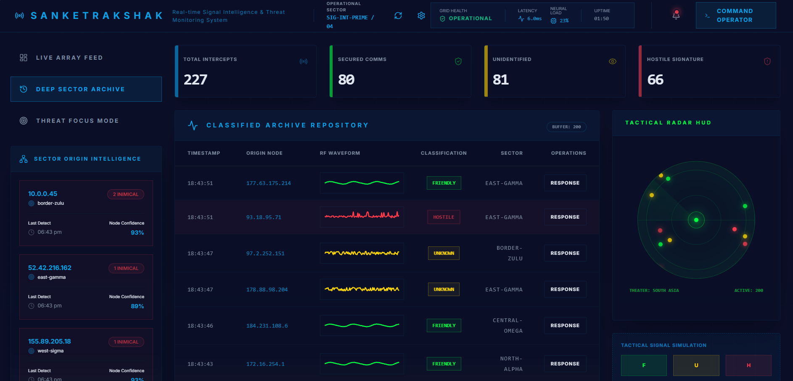

# SignalRakshak 🇮🇳

AI-powered real-time signal intelligence and threat monitoring dashboard.

## 🚀 Features
- 📡 Real-time signal interception
- 🧠 AI-based classification (Friendly / Unknown / Hostile)
- 🗺️ Tactical radar visualization
- 🔔 Live alert system
- 📊 Real-time data stream

## 🛠 Tech Stack
- Next.js
- TypeScript
- Firebase
- Tailwind CSS
- Vercel

## Screenshots 
### Deep Sector Archive 

## 🌐 Live Demo
https://signal-rakshak.vercel.app

## 📌 Description
SignalRakshak is a defense-oriented dashboard that simulates real-time signal monitoring and classification using AI concepts.

---

⚡ Built for Hackathon
